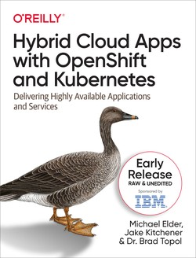

# Overview

The open-cluster-management.io project is focused on how to simplify fleet management for Kubernetes and OpenShift. There are a few simple concepts to understand when getting started:

1. _Hub_ cluster (represented by the `ClusterManager` API): When managing a fleet, one cluster is designated as the _hub_ where other clusters connect to receive desired configuration and behavior.
2. _Managed cluster_ (represented by the `ManagedCluster` API): Any cluster that runs the agent (`Klusterlet`, described shortly) and connects to a _hub_.
3. `ManifestWork`: An API that describes desired configuration that should be applied to a _managed cluster_.
4. `PlacementRule`: An API that describes how workloads should be placed across the fleet.

# Getting started

Let's start with a simple example using 2 [KinD clusters](https://kind.sigs.k8s.io/). We'll have a cluster named `hub` and a second named `cluster`.

> **NOTE** that the [kind-hub-cluster.yaml](examples/kind-hub-cluster.yaml) configuration for the _hub_ cluster is defined to allow the Kubernetes API server to amend `docker.for.mac.localhost` to its X.509 certificate identity so that the agent will be able to successfully connect to the _hub_ API server from the second KinD cluster. If you are not following these steps on OS X, you may need to adjust this configuration for your own [KinD](https://kind.sigs.k8s.io/docs/user/configuration#kubeadm-config-patches) clusters using the [kubeadm settings](https://kubernetes.io/docs/setup/production-environment/tools/kubeadm/control-plane-flags/).

```bash
# The kind-hub cluster requires additional configuration
$ kind create cluster --name=hub --config=examples/kind-hub-cluster.yaml

# The kind-cluster cluster is a basic kind cluster
$ kind create cluster --name=cluster

$ kind get clusters
cluster
hub
```
_Example: Create a cluster using the [kind-hub-cluster.yaml](examples/kind-hub-cluster.yaml) configuration to ensure that `docker.for.mac.localhost` is defined among the Subject Alternate Names (SANs) for the Kubernetes API server._

You can switch between `kubeconfig` settings for each cluster using:

```bash
# Use the kubeconfig for the managed cluster
kind export kubeconfig --name=cluster

# Use the kubeconfig for the hub cluster
kind export kubeconfig --name=hub
```

## Deploy the Cluster Manager

Let's deploy the [Cluster Manager](https://operatorhub.io/operator/cluster-manager) to the _hub_.

We need the Operator Lifecycle Manager (OLM) running on our cluster. If you're running OKD or OpenShift, you already have the OLM pods running and you can skip the following step.

```bash
$ kind export kubeconfig --name=hub
$ curl -sL https://github.com/operator-framework/operator-lifecycle-manager/releases/download/v0.18.1/install.sh | bash -s v0.18.1
```

Next, deploy the `Cluster Manager` operator by applying the OLM subscription:

```bash
$ kubectl create -f https://operatorhub.io/install/cluster-manager.yaml
subscription.operators.coreos.com/my-cluster-manager created
```
Next, we deploy the `ClusterManager` operand in the `operator.open-cluster-management.io/v1` API group. The `ClusterManager` operand will start the pods that listen for _managed clusters_ to be imported and service API like `ManagedCluster`.

```bash
$ kubectl apply -f examples/cluster-manager.yaml
clustermanager.operator.open-cluster-management.io/cluster-manager created
```
_Example: Deploy the [cluster-manager.yaml](examples/cluster-manager.yaml)._

By creating the `ClusterManager` operand, you are telling the operator run the pods that service the CustomResourceDefinitions (CRDs) or API for dealing with concepts like cluster inventory, Role-Based Access Control (RBAC) and work distribution (assigning desired configuration to _managed clusters_ in the fleet).

Verify the running pods in the `open-cluster-management-hub` namespace:

```bash
$ kubectl get clustermanager
NAME              AGE
cluster-manager   5m19s

$ kubectl get pods -n open-cluster-management-hub
NAME                                                       READY   STATUS    RESTARTS   AGE
cluster-manager-registration-controller-6586874ccc-475mt   1/1     Running   1          4m25s
cluster-manager-registration-controller-6586874ccc-cg2qb   1/1     Running   2          4m25s
cluster-manager-registration-controller-6586874ccc-mq472   1/1     Running   1          4m25s
cluster-manager-registration-webhook-58c7d64d9f-295tx      1/1     Running   2          4m25s
cluster-manager-registration-webhook-58c7d64d9f-2lmx2      1/1     Running   1          4m25s
cluster-manager-registration-webhook-58c7d64d9f-m578d      1/1     Running   1          4m25s
cluster-manager-work-webhook-57c5db85f5-6jhgm              0/1     Pending   0          4m25s
cluster-manager-work-webhook-57c5db85f5-dwmcw              1/1     Running   1          4m25s
cluster-manager-work-webhook-57c5db85f5-mfnf4              0/1     Pending   0          4m25s
```

## Deploy the `Klusterlet` agent

Now let's *import* the _managed cluster_ to the _hub_ by deploying the [Klusterlet](https://operatorhub.io/operator/klusterlet) agent. The `Klusterlet` runs a set of pods that register and connect back to _hub_. The `Klusterlet` operator just runs the pods that service the `Klusterlet` operand, so the pods for registration and work reconcilation will not start until we actually define the `Klusterlet` operand.

We're now going to switch to the KinD cluster named `cluster` and configure the `Klusterlet` operator and supporting `Klusterlet` operand.

Again, deploy the Operator Lifecycle Manager (OLM) to the _managed cluster_ if using KinD:

```bash

# Install the Operator Lifecycle Manager if not present
$ curl -sL https://github.com/operator-framework/operator-lifecycle-manager/releases/download/v0.18.1/install.sh | bash -s v0.18.1

# Configure the OLM subscription for the Klusterlet operator
$ kubectl create -f https://operatorhub.io/install/klusterlet.yaml
```

Once operator is ready, deploy the Klusterlet agent pods by configuring the `Klusterlet` operand:

```bash
$ kubectl apply -f examples/klusterlet.yaml
```
_Example: Deploy the [klusterlet.yaml](examples/klusterlet.yaml)._

Now the `Klusterlet` operand will start the pods for `registration` and `work`. However, we can see that the `registration` pods will fail to successfully start until we supply the required `bootstrap-hub-kubeconfig` that allows the `registration` pods to connect to the API server of the _hub_.

To limit the access of the `klusterlet` agent, we are going to supply a `ServiceAccount` user (named `bootstrap-sa`) that only has access to create `CertificateSigningRequests`. Once approved by the `cluster-admin` on the hub can approve the `CSR` to assign a valid X.509 identity for the `klusterlet` agent. Additional privileges for the agent to interact with resources in its assigned `Namespace` on the _hub_ will then be assigned to this X.509 certificate identity.

```bash
# The generate-bootstrap-kubeconfig.sh assumes you have a `kind` cluster named `kind-hub`
$ ./generate-bootstrap-kubeconfig.sh

$ export KUBECONFIG=kind-hub.kubecfg
$ kind export kubeconfig --name=hub

$ kubectl create secret generic bootstrap-hub-kubeconfig \
    -n open-cluster-management-agent --from-file=kubeconfig=bootstrap-hub.kubeconfig
```

Approve the `CertificateSigningRequest` on the _hub_ to generate an X.509 identity for the `klusterlet` agent.

```bash
$ kubectl get csr
NAME                 AGE     SIGNERNAME                                    REQUESTOR                                         CONDITION
csr-rclvs            29m     kubernetes.io/kube-apiserver-client-kubelet   system:node:hub-control-plane                     Approved,Issued
kind-cluster-8nzxw   8m39s   kubernetes.io/kube-apiserver-client           system:serviceaccount:kind-cluster:bootstrap-sa   Pending

$ kubectl certificate approve kind-cluster-8nzxw
certificatesigningrequest.certificates.k8s.io/kind-cluster-8nzxw approved
```

In addition to the acceptance of the X.509 certificate identity of the agent (e.g. `kind-cluster-8nzxw` in the example output above), the _hub_ must accept the `ManagedCluster` as well. The `ManagedCluster` will be created as the `klusterlet` attempts to connect to the _hub_ if it does not already exist.

```bash
$ kubectl get managedclusters
NAME           HUB ACCEPTED   MANAGED CLUSTER URLS   JOINED   AVAILABLE   AGE
kind-cluster   false                                                      10m
```

There is a sub-resource for `ManagedClusters/hubAcceptsClient` to ensure only users that have been assigned the permission to update `hubAcceptsClient` are allowed to perform this approval process. While the `klusterlet` can create a `ManagedCluster` and query for information about it, it cannot explicitly approve its own attempt to join.

```bash
$ kubectl patch managedclusters kind-cluster --type=merge -p '{"spec":{"hubAcceptsClient":true}}'
managedcluster.cluster.open-cluster-management.io/kind-cluster patched
```

At this point, you should now have a joined `ManagedCluster` attached to your _hub_:

```bash
$ kubectl get managedclusters
NAME           HUB ACCEPTED   MANAGED CLUSTER URLS   JOINED   AVAILABLE   AGE
kind-cluster   true                                  True     True        17m
```

You can streamline the final cluster join approval step if you anticipate the `ManagedCluster` of a specific name joining the _hub_ by pre-creating the `ManagedCluster` on the _hub_. Because `spec.hubAcceptsClient` is already `true`, any cluster that connects as `kind-cluster` will automatically be accepted.

```bash
apiVersion: cluster.open-cluster-management.io/v1
kind: ManagedCluster
metadata:
  labels:
    apps.pacman: deployed
    cloud: mylaptop
    name: kind-cluster
    region: us-east-1
    vendor: kind
  name: kind-cluster
spec:
  hubAcceptsClient: true
  leaseDurationSeconds: 60
```
_Example: You can optionally predefine the [ManagedCluster](examples/managedcluster.yaml)._


## Apply desired state to the managed cluster

Now that the `ManagedCluster` has joined, let's push a simple configuration to it. The https://open-cluster-management.io project establishes the `ManifestWork` API in the `work.open-cluster-managment.io/v1` API group. Any `ManifestWork` destined for a given `ManagedCluster` should be defined in its associated cluster namespace defined on the _hub_.

The `ManifestWork` below will create a `Namespace` and `Deployment` on the managed cluster.

```yaml
apiVersion: work.open-cluster-management.io/v1
kind: ManifestWork
metadata:
  name: helloworld-manifest
  namespace: kind-cluster
spec:
  workload:
    manifests:
    - apiVersion: v1
      kind: Namespace
      metadata:
        name: helloworld
    - apiVersion: apps/v1
      kind: Deployment
      metadata:
        name: helloworld
        namespace: helloworld
      spec:
        selector:
          matchLabels:
            app: nginx
        replicas: 2 # tells deployment to run 2 pods matching the template
        template:
          metadata:
            labels:
              app: nginx
          spec:
            containers:
            - name: nginx
              image: nginx:latest
              ports:
              - containerPort: 80
```

Apply the `ManifestWork` to the _hub_ cluster:

```bash
$ kubectl apply -f examples/manifestwork/helloworld-manifest.yaml
```
_Example:  [helloworld-manifest.yaml](examples/manifestwork/helloworld-manifest.yaml)._

By applying the `ManifestWork`, the `klusterlet` agent will create the desired resources including the `Namespace` and the `Deployment`.

```bash
# On the managed cluster, verify the resources were created
$ kubectl get all -n helloworld
NAME                             READY   STATUS    RESTARTS   AGE
pod/helloworld-585449566-hbzrc   1/1     Running   0          30s
pod/helloworld-585449566-zwnzm   1/1     Running   0          42s

NAME                         READY   UP-TO-DATE   AVAILABLE   AGE
deployment.apps/helloworld   2/2     2            2           2m4s

NAME                                    DESIRED   CURRENT   READY   AGE
replicaset.apps/helloworld-585449566    2         2         2       42s
replicaset.apps/helloworld-66b6c48dd5   0         0         0       2m4s
```

Finally, you can either update the `ManifestWork` and see the updates propagate over or delete the `ManifestWork` to see all objects removed.

```bash
$ kubectl delete -f examples/manifestwork/helloworld-manifest.yaml
```

# Summary

In this simple example, you were able to create two clusters using KinD and assign one of them to act as a _hub_ and one of them to act as a _managed cluster_. We then deployed the operators for [Cluster Manager](https://operatorhub.io/operator/cluster-manager) and the [Klusterlet](https://operatorhub.io/operator/klusterlet) agent. We configured the `Klusterlet` to join the _hub_ and received desired configuration.

These are simple building blocks that can enable a broad array of capabilities. The supported [product offering](https://www.redhat.com/en/technologies/management/advanced-cluster-management) from Red Hat builds on these primitives to enable auditable configuration management, multicluster application delivery, multicluster observability (via Thanos) and multicluster networking (via Submariner) and other multicluster use cases.

# Get Involved

If you're interested to get involved with the [open-cluster-management.io](https://open-cluster-management.io) project, join us on the [#open-cluster-mgmt](https://kubernetes.slack.com/archives/C01GE7YSUUF) Slack channel on the Kubernetes Slack team or participate in the [bi-weekly community meetings](https://github.com/open-cluster-management/community/projects/1)!

# References

1. [open-cluster-management.io](https://open-cluster-management.io) - the official project website.
2. [Register Cluster with the Klusterlet](https://open-cluster-management.io/getting-started/core/register-cluster/) - project documentation for cluster registration.
2. [YouTube/Managing the Open Hybrid Cloud with Red Hat Advanced Cluster Management](https://www.youtube.com/watch?v=K-H-XZH5kKI) (28m)
2. [YouTube/Introducing github.com/open-cluster-management at All Things Open](https://www.youtube.com/watch?v=1aab7B0Nnwo) (40m)
2. [How to get started with Red Hat Advanced Cluster Management](https://www.openshift.com/blog/how-to-get-started-with-red-hat-advanced-cluster-management-for-kubernetes) - describes how to consume Open Cluster Management from Red Hat's supported offering of the project.
3. [Connecting managed clusters with Submariner in Red Hat Advanced Cluster Management for Kubernetes](https://www.openshift.com/blog/connecting-managed-clusters-with-submariner-in-red-hat-advanced-cluster-management-for-kubernetes)
4. [How to use the Certificate Policy Controller to Identify Risks in Red Hat Advanced Cluster Management for Kubernetes](https://www.openshift.com/blog/how-to-use-the-certificate-policy-controller-to-identify-risks-in-red-hat-advanced-cluster-management-for-kubernetes)
5. [K8s Integrity Shield (tech-preview): Protecting the Integrity of Kubernetes Resources with Signature](https://www.openshift.com/blog/k8s-integrity-shield-tech-preview-protecting-the-integrity-of-kubernetes-resources-with-signature)
6. [Integrating Gatekeeper with Red Hat Advanced Cluster Management for Kubernetes](https://www.openshift.com/blog/integrating-gatekeeper-with-red-hat-advanced-cluster-management-for-kubernetes)
7. [Contributing and deploying community policies with Red Hat Advanced Cluster Management and GitOps](https://www.openshift.com/blog/tag/red-hat-advanced-cluster-management)
8. [Address CVEs Using Red Hat Advanced Cluster Management Governance Policy Framework](https://www.openshift.com/blog/address-cves-using-red-hat-advanced-cluster-management-governance-policy-framework)


[ Hybrid Cloud Apps with OpenShift and Kubernetes from O'Reilly](https://www.oreilly.com/library/view/hybrid-cloud-apps/9781492083801/)